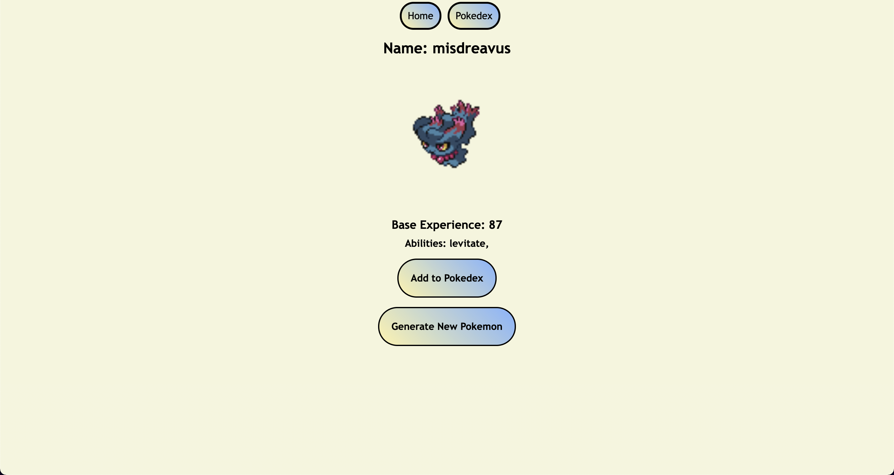
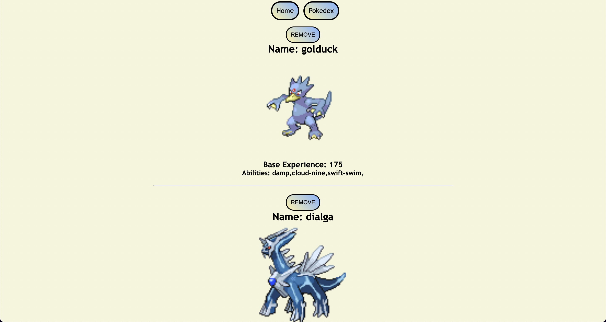

# Pokedex
- This web app generates a random Pokemon from my database and shows crucial stats about them
- Users can add a fitting Pokemon to their Pokedex and delete from there
- Incorporated the PokeAPI to scrape Pokemon into my MongoDB database
- Used React in order to display fetched information as well as React Router to create different pages
- Backend is currently hosted on [Railway](https://railway.app/)

